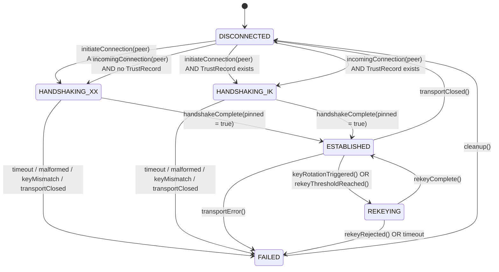
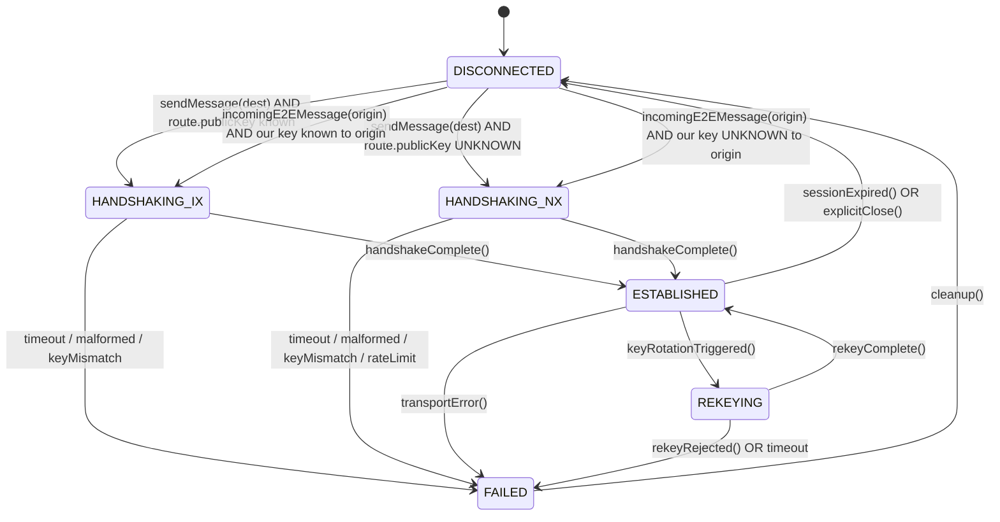

# ADR: Noise Session State Machine

**Status**: Proposed
**Date**: 2025-07-24
**Deciders**: [TBD]
**Consulted**: [TBD]

## Context

The MeshLink specification defines four Noise handshake patterns:

- `Noise_XX_25519_ChaChaPoly_SHA256` — link layer, first contact (TOFU)
- `Noise_IK_25519_ChaChaPoly_SHA256` — link layer, post-TOFU reconnect (0-RTT)
- `Noise_IX_25519_ChaChaPoly_SHA256` — end-to-end layer, origin knows destination key
- `Noise_NX_25519_ChaChaPoly_SHA256` — end-to-end fallback, destination key unknown

The specification does not define the session lifecycle: timeouts, concurrent handshakes, rekeying, transport migration (GATT ↔ L2CAP CoC), or failure recovery. This ADR defines a complete state machine for Noise sessions at both link and end-to-end layers.

## Decision

### Session State Enum

```kotlin
enum class NoiseSessionState {
    DISCONNECTED,
    HANDSHAKING_XX,         // Link layer: first contact, TOFU pin
    HANDSHAKING_IK,         // Link layer: reconnect with pinned keys, 0-RTT
    HANDSHAKING_IX,         // E2E layer: origin knows destination static key
    HANDSHAKING_NX,         // E2E fallback: destination static key unknown
    ESTABLISHED,            // Traffic keys active, application data flowing
    REKEYING,               // Key rotation in progress (initiated by either side)
    FAILED(reason: NoiseFailureReason)
}

enum class NoiseFailureReason {
    HANDSHAKE_TIMEOUT,
    HANDSHAKE_MESSAGE_MALFORMED,
    HANDSHAKE_MESSAGE_OUT_OF_ORDER,
    REMOTE_STATIC_KEY_MISMATCH,    // TOFU pin violation
    REMOTE_STATIC_KEY_UNKNOWN,     // NX fallback: peer key not in route table
    REKEY_REJECTED,
    TRANSPORT_CLOSED,
    MAX_RETRIES_EXCEEDED,
    INTERNAL_ERROR
}

enum class NoiseLayer {
    PEER,       // Hop-by-hop encryption between direct peers
    MESH        // Origin-to-destination encryption across mesh
}

enum class NoiseRole {
    INITIATOR,  // We sent the first handshake message
    RESPONDER   // We received the first handshake message
}
```

### Session Data Model

```kotlin
@Serializable
data class NoiseSession(
    val sessionId: SessionId,                    // 64-bit random, unique per session
    val peerId: PeerIdentity,                          // Remote peer's stable identifier
    val layer: NoiseLayer,                       // PEER or MESH
    val state: NoiseSessionState,
    val role: NoiseRole,                         // INITIATOR or RESPONDER
    val handshakePattern: HandshakePattern,      // XX, IK, IX, NX
    val localKeyPair: KeyPair,                   // Our long-term identity keys (Ed25519 + X25519)
    val remotePublicKey: PublicKey?,             // Peer's long-term public key (pinned or from route)
    val handshakeHash: ByteArray,                // Hash of all handshake messages (h)
    val chainingKey: ByteArray,                  // Chaining key (ck) for key derivation
    val encryptionKey: ByteArray?,               // Encryption key (k); null until ESTABLISHED
    val messageNonce: UInt = 0,                  // Nonce counter (n) for AEAD
    val createdAt: Instant,
    val updatedAt: Instant,                      // Last state transition or message processed
    val handshakeMessageNumber: UInt = 0,        // Which handshake message we expect next
    val retryCount: Int = 0,                     // Handshake retries (for XX/IK only)
    val transport: TransportHandle,              // GATT connection or L2CAP CoC channel
    val isZeroRttAttempted: Boolean = false,     // For IK: whether 0-RTT data was sent
)
```

### State Transitions

#### Peer Layer (PEER)



#### Mesh Layer (MESH)



### Timeouts

| Transition | Timeout | Action on Expiry |
|------------|---------|------------------|
| `DISCONNECTED → HANDSHAKING_XX` | 10 s | `FAILED(HANDSHAKE_TIMEOUT)` |
| `DISCONNECTED → HANDSHAKING_IK` | 10 s | `FAILED(HANDSHAKE_TIMEOUT)` |
| `DISCONNECTED → HANDSHAKING_IX` | 10 s | `FAILED(HANDSHAKE_TIMEOUT)` |
| `DISCONNECTED → HANDSHAKING_NX` | 10 s | `FAILED(HANDSHAKE_TIMEOUT)` (stricter: 10s vs 30s for IX) |
| `ESTABLISHED → REKEYING` | 30 s | `FAILED(HANDSHAKE_TIMEOUT)` |
| `REKEYING → ESTABLISHED` | 30 s | `FAILED(HANDSHAKE_TIMEOUT)` |
| Any state → `FAILED` | — | Immediate on transport close |

### Retry Limits

| Pattern | Max Retries | Backoff |
|---------|-------------|---------|
| XX (initiator) | 3 | 1s, 2s, 4s |
| IK (initiator) | 2 | 1s, 2s |
| IX (initiator) | 3 | 1s, 2s, 4s |
| NX (initiator) | 3/minute (rate limited) | 1s, 2s, 4s |
| Responder (all) | No retry — fail immediately on error | — |

### Concurrency Rules

1. **One session per peer per layer**: At most one `PEER` session and one `MESH` session per `PeerIdentity` at any time.
2. **Handshake serialization**: If a handshake is in progress for a peer/layer, new handshake attempts for that peer/layer are queued or rejected with `FAILED(MAX_RETRIES_EXCEEDED)`.
3. **Transport migration**: When L2CAP CoC becomes available, the `PEER` session migrates seamlessly:
   - `transport` updates from GATT handle to L2CAP CoC handle
   - No handshake restart; `encryptionKey`, `chainingKey`, and `messageNonce` continue unchanged
   - In-flight writes on GATT complete or are cancelled; new writes go to L2CAP
   - If L2CAP write fails, fall back to GATT for that message only (session persists)
   - Diagnostic event: `transport.migration.completed` with `oldTransport = GATT`, `newTransport = L2CAP`
   - Migration is one-way (GATT → L2CAP); reverse migration not supported

### Key Rotation (Rekeying)

Triggered by:

- Message count reaches `2^64 - 1` (nonce exhaustion)
- Local key rotation timer (default 3 days, configurable)
- Remote `KeyRotationAnnouncement` received

Process:

1. Initiator sends `RekeyMessage` (Noise handshake message with new static key)
2. Both sides enter `REKEYING` state
3. On success: new `trafficKey`, `chainingKey`, `messageNonce = 0`, `handshakeHash` updated
4. Old keys retained for `gracePeriod` (default 1 hour) to decrypt in-flight messages

### Failure Handling

| Failure | Link Layer Action | E2E Layer Action |
|---------|-------------------|------------------|
| `HANDSHAKE_TIMEOUT` | Retry per table above | Retry per table above |
| `REMOTE_STATIC_KEY_MISMATCH` | `FAILED` → notify TrustStore (TOFU violation) | `FAILED` → routing layer: key unknown |
| `TRANSPORT_CLOSED` | `FAILED` → peer marked `DISCONNECTED` | `FAILED` → transfer layer: `unreachable` |
| `REKEY_REJECTED` | Stay `ESTABLISHED` with old keys | Stay `ESTABLISHED` with old keys |
| `MAX_RETRIES_EXCEEDED` | `FAILED` → backoff 60s before new attempt | `FAILED` → backoff 60s before new attempt |

### Diagnostic Events

Each state transition emits a `DiagnosticEvent.NoiseSessionTransition`:

```kotlin
data class NoiseSessionTransition(
    val sessionId: SessionId,
    val peerId: PeerIdentity,
    val layer: NoiseLayer,
    val fromState: NoiseSessionState,
    val toState: NoiseSessionState,
    val role: NoiseRole,
    val handshakePattern: HandshakePattern?,
    val failureReason: NoiseFailureReason?,
    val timestamp: Instant,
)
```

## Consequences

### Positive

- Deterministic behavior across Android and iOS implementations
- Explicit timeouts and retries prevent indefinite hangs
- Clear migration path for transport changes (GATT ↔ L2CAP)
- Observable state for debugging and testing

### Negative

- Added complexity in session manager implementation
- Must handle race conditions between transport events and handshake messages
- Rekeying adds a second handshake flow to implement and test

## Implementation Notes

- `NoiseSession` is immutable; state transitions produce new instances
- `NoiseSessionManager` (per layer) holds `MutableMap<PeerIdentity, NoiseSession>` and processes events sequentially per peer
- All timeouts driven by `MainTestClock` in tests; `kotlinx-datetime` `Clock.System` in production
- `handshakeHash` and `chainingKey` are 32-byte arrays per Noise spec
- `trafficKey` is 32-byte ChaCha20-Poly1305 key
- `messageNonce` is 64-bit (UInt) per Noise spec; rekey on overflow

## Related Decisions

- [E2E Handshake Pattern](../crypto/e2e-handshake-pattern.md)
- [Key Rotation Protocol](../crypto/key-rotation-protocol.md)
- [NX Fallback Mitigation](../crypto/nx-fallback-mitigation.md)
- [E2E Routing Over Mesh](../crypto/e2e-routing-over-mesh.md)

## References

- [Noise Protocol Framework Revision 34](https://noiseprotocol.org/noise.pdf)
- [RFC 9147 DTLS 1.3 — rekey patterns](https://www.rfc-editor.org/rfc/rfc9147.html)
