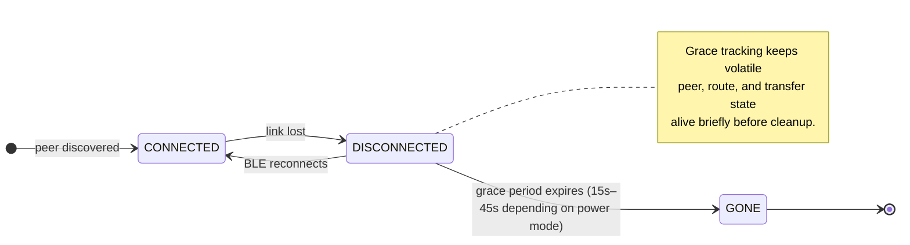

# The Peer Lifecycle Model

## The problem

In a BLE mesh, peers appear and disappear constantly. Phones move out of range,
operating systems suspend BLE work, and connections drop under interference. The
mesh has to smooth that churn into something a host app can reason about.

The naive approach is to forget a peer as soon as a BLE link drops. That causes:

- route flapping on momentary interference
- transfer sessions being abandoned unnecessarily
- noisy found/lost churn when a peer disappears briefly and returns

## The three-state model



### Connected

- Active BLE link
- Transfers may be in progress
- Route entries remain live
- The host app observes connected presence in the `peers` snapshot

### Disconnected

- BLE link was lost
- A grace period is active because the peer may return quickly
- Routes can degrade before they are fully retracted
- Transfers can pause instead of being abandoned immediately
- The host app observes disconnected presence rather than immediate removal

### Gone

- The grace window expired without reconnection
- MeshLink cleans up ephemeral state such as presence, routes, and pending
  transfer work tied to the peer
- Pinned trust state remains, so a future reconnection with the same identity is
  still recognized
- transient unverified peers are removed from `peers`; persisted trust remains unavailable

## How the grace period works

When a peer disconnects unexpectedly, MeshLink starts a fixed grace timer
whose duration depends on the power mode (HIGH=15s, MEDIUM=30s, LOW=45s).
If the peer reconnects before the timer expires, it moves back to CONNECTED.
If the timer fires without reconnection, the peer moves to GONE and
eviction of ephemeral state begins.

This keeps the public API unchanged. The explicit withdrawal remains private
control-plane behavior inside the runtime.

## PeerStateCoordinator

`PeerStateCoordinator` is the internal cleanup loop that drives this lifecycle.
Conceptually, it starts a fixed grace timer per disconnected peer and evicts
the peer when the timer fires without reconnection.

The important public point is that host apps do not need to implement their own
peer-loss timer just to smooth normal transport churn.

## Why "Gone" is not a public state

The public API exposes peer snapshots through `peers`, not the internal
lifecycle enum. When a peer reaches the internal gone state:

- transient presence and route state are removed;
- an unverified peer disappears from `peers`;
- a persisted trusted or revoked peer remains with unavailable presence; and
- pinned trust remains available for a future authenticated reconnect.

Exposing internal `GONE` directly would couple applications to cleanup timing.
The public presence snapshot instead describes whether a known identity is
currently actionable.

## The seqNo interaction

When a peer reconnects, the route has to come back with fresher routing state.
If the reconnect path reuses stale sequence information, differential routing
can suppress propagation to neighbors even though the route is valid again.

That is why reconnect logic needs a fresh seqno progression when it re-installs
reachability. Without it, the local node can look healed while neighboring
nodes keep stale route knowledge.

## Impact on the consuming app

From the app's perspective, the right model is still simple:

```kotlin
meshLink.peers.collect { peers ->
    renderPeers(peers)
}
```

The app does not need to reconstruct current state from found, changed, and lost
events or manage grace periods itself. MeshLink handles transport churn and
publishes one current snapshot.
