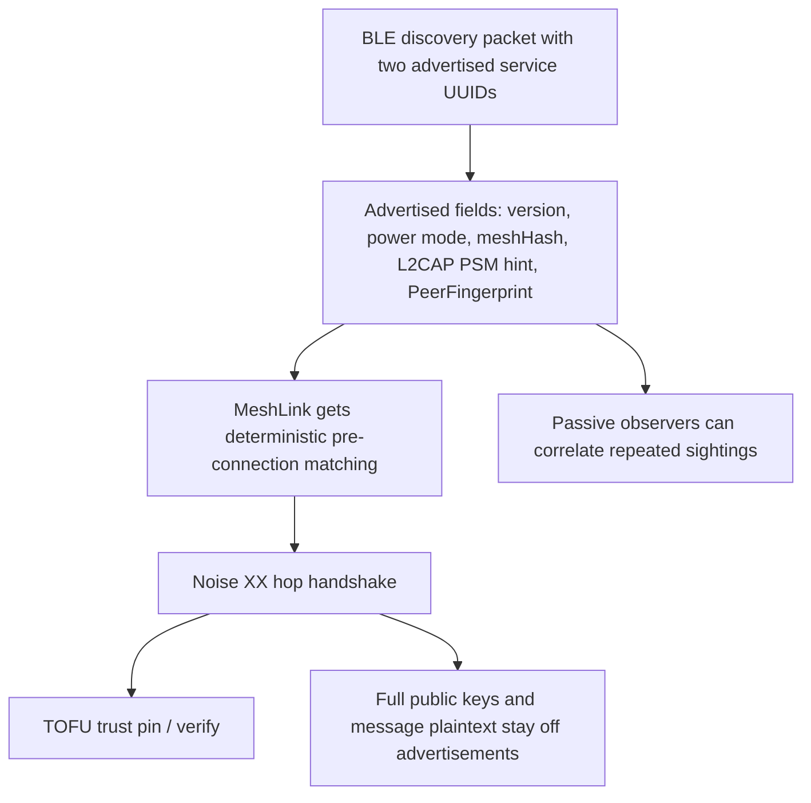

# Discovery identity hash and privacy trade-offs

## The current decision

MeshLink no longer uses rotating advertisement pseudonyms. Instead, discovery
uses two advertised service UUIDs in a single packet:

- a fixed 32-bit discovery UUID: `4d455348`
- a second 128-bit service UUID whose 16 raw bytes carry the MeshLink discovery
  payload

That payload contains:

- protocol version bits (3 bits)
- platform (2 bits)
- power-mode bits (3 bits)
- a 16-bit `meshHash`
- the L2CAP PSM hint (8 bits)
- a 12-byte `PeerFingerprint`

`PeerFingerprint` is the first 12 bytes of:

```text
SHA-256(Ed25519Pub || X25519Pub)
```



## What this changes for privacy

This is a deliberate trade-off.

A passive observer can now correlate repeated sightings of the same device more
easily than with rotating pseudonyms, because `PeerFingerprint` is stable for a
given identity. In return, MeshLink gets a deterministic, compact discovery hint
that fits in one advertisement packet and aligns with its direct TOFU trust model.

## What remains protected

Even with a stable discovery hint:

- full public keys are not advertised directly
- message plaintext never appears in advertisements
- hop-to-hop and end-to-end session keys are still established after discovery
- trust decisions still depend on the authenticated Noise XX session, not only
  on the advertised `PeerFingerprint`

> **Two sessions, not one.** The "Noise XX session" referenced here is the
> **hop-by-hop link** handshake between adjacent nodes. The **end-to-end** session
> between the message origin and its final destination is a separate **Noise IX**
> handshake (`Noise_IX_25519_ChaChaPoly_SHA256`) — see
> [docs/decisions/crypto/e2e-handshake-pattern.md](../decisions/crypto/e2e-handshake-pattern.md).
> Relays terminate only the link session and forward the still-sealed E2E frame.

## Why keep the 12-byte PeerFingerprint

The 12-byte prefix is small enough to fit the advertisement contract while still
being stable enough for deterministic initiation and peer matching. It is a
hint, not the canonical trust-store record.

## NX fallback uses PeerFingerprint for initial filtering

When an origin peer lacks the destination's full public key for an E2E IX
handshake, it uses the NX fallback. The origin includes the full 64-byte
concatenated public key (Ed25519 || X25519) in the NX handshake payload. The
destination verifies the received static key matches that full public key
byte-for-byte (not just the PeerFingerprint). The `PeerFingerprint` in the
advertisement serves as an initial filter before the handshake.
